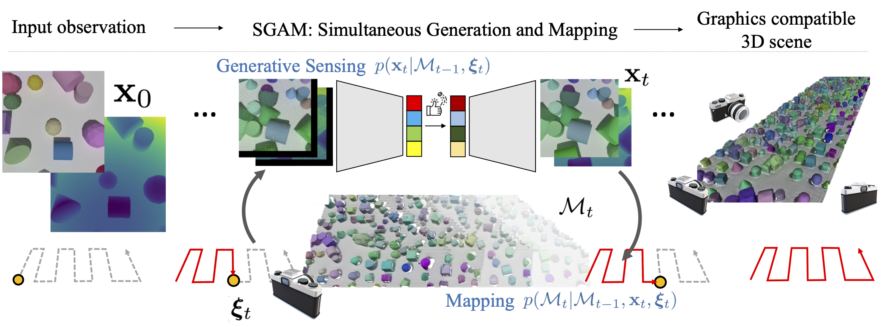

# SGAM: Building a Virtual 3D World through Simultaneous Generation and Mapping
[Yuan Shen<sup>1</sup>](https://yshen47.github.io/),
[Wei-Chiu Ma<sup>2</sup>](https://people.csail.mit.edu/weichium/),
[Shenlong Wang<sup>1</sup>](https://shenlong.web.illinois.edu/)<br/>
Unversity of Illinois at Urbana-Champaign<sup>1</sup>, Massachusetts Institute of Technology<sup>2</sup>
#### Accepted at NeurIPS 2022.  
[Paper link](https://nips.cc/Conferences/2022/Schedule?showEvent=55439) │ [Project Page](https://yshen47.github.io/sgam) │ [Colab Quickstart](https://colab.research.google.com/drive/1nW5oHKsb0e01BdFU-EjsNqJmQNNo294h?usp=sharing)


## TL;DR
We present a new 3D scene generation framework that simultaneously generates sensor data at novel viewpoints and builds a 3D map. Our framework is illustrated in the diagram below. The GIF animation above is generated via SGAM with only the first RGB-D frame known.

  
## Quickstart
Try [our Colab codebook](https://colab.research.google.com/drive/1nW5oHKsb0e01BdFU-EjsNqJmQNNo294h?usp=sharing) to play our trained models on sample CLEVR-Infinite and GoogleEarth-Infinite dataset!
## Installment
- Docker Image (Recommended): 
  1. Prerequisite: make sure you have [nvidia-docker](https://github.com/NVIDIA/nvidia-docker) installed, and a nvidia GPU on your device. 
  2. Run the following command to get our docker image:
     ```angular2html
     docker pull yshen47/sgam:latest
     ```
  3. Clone our github repository into directory [proj_root].
     ```angular2html
     git clone git@github.com:yshen47/SGAM.git
  4. Copy the trained_models directory located in /root/trained_models inside the docker container to [proj_root]/trained_models. 
     Note that the trained checkpoints inside the docker image are the same as the ones from [here](#trained-models). 

  5. Run the following command to start the SGAM docker container at directory [proj_root]. This command will mount the SGAM codebase to the container
     ```angular2html
     nvidia-docker run -it --rm --gpus all --volume $PWD:/root/sgam yshen47/sgam:latest
     ```
  6. If everything runs correctly, then you should be able to run the following command and get unrolling results at directory grid_res/
     ```angular2html
     python main_scene_generation.py
     ```
  
- Manual Installment (Only tested on Ubuntu 18.04):

  1. Create Conda environment and install part of python packages 
     ```angular2html
     conda create -n sgam python=3.8.13
     conda activate sgam
     pip install -r requirement.txt
     ```
  2. Install pytorch and pytorch_lightning
     ```angular2html
     pip install torch==1.7.1 torchvision==0.8.2 
     pip install pytorch_lightning==1.5.10
     
  3. Install cmake that has version > 3.20, required to compile pytorch3d from source. Run in sudo access if needed. 
     Change apt-add respository based on Ubuntu version ([Reference](https://askubuntu.com/questions/355565/how-do-i-install-the-latest-version-of-cmake-from-the-command-line)).
     If you previously added repository inconsistent with your Ubuntu version, remove the incorrect line in /etc/apt/sources.list ([Reference](https://ostechnix.com/how-to-delete-a-repository-and-gpg-key-in-ubuntu/))
        ```
        apt purge --auto-remove cmake
        wget -O - https://apt.kitware.com/keys/kitware-archive-latest.asc 2>/dev/null | gpg --dearmor - | tee /etc/apt/trusted.gpg.d/kitware.gpg >/dev/null
        apt-get install software-properties-common
        apt-add-repository 'deb https://apt.kitware.com/ubuntu/ bionic main'
        apt update
        apt install cmake
        ```
  4. Install pytorch3d and other dependencies. Check [their official installment instruction](https://github.com/facebookresearch/pytorch3d/blob/main/INSTALL.md) 
     ```angular2html
     conda install -c fvcore -c iopath -c conda-forge fvcore iopath
     conda install -c bottler nvidiacub
     apt-get install g++
     mkdir ../third_parties && cd ../third_parties
     git clone https://github.com/facebookresearch/pytorch3d.git
     cd pytorch3d && pip install -e .
     ```
  5. If it complains about libGL.so missing, try the following command:
    ```
     apt-get install ffmpeg libsm6 libxext6  -y
    ```
## Data
### CLEVR-Infinite Dataset 
  - To get a quick glance at our dataset, here is [one tiny scene example](https://drive.google.com/drive/folders/1Y2q3GQMFu8TUgdnWbDXi7-ErRPGy6QwG?usp=sharing). 
  - Two validation scene data can be downloaded from [this link](https://drive.google.com/drive/folders/1ZjG8sYQWtQKPewlqcCbW6JyypwSapZDD?usp=sharing). 
  - To generate the training dataset at a large scale, we provide the blender script in clevr_generation directory. We randomly distribute primitive 3D objects by simulating flying objects falling and collision. 
    Detailed steps are as follows:
    1. find a device that has GPU, and then install blender 2.92 
      ```angular2html
      sudo snap install blender --channel=2.92/stable --classic
      ```
    2. (optional) If you want to visualize one CLEVR-Infinite scene, run the following command.
      ```
      /snap/bin/blender random_scene.blend
      ```
    3. Specify output directory in line 213
    
    4. Run the following command to render. You can change the iteration number to set the number of random scene.
    ```
      bash blender_generation.sh
    ```
    5. Run the postprocessing script to get rgb, depth map and transform.json
    ```
      python convert_exr.py
    ```
      
### GoogleEarth-Infinite Dataset

### KITTI360 Dataset
## Trained Models
We provide our trained model on [GoogleEarth-Infinite](https://drive.google.com/drive/folders/1XzyLEFOWOktIgWbt3elMr5O6hbSWB7X3?usp=sharing) and [CLEVR-Infinite](https://drive.google.com/drive/folders/1AF5Q-Wq19YBAxFFjGuH6nWR-BPaKHmT7?usp=sharing). As for KITTI360, we will release in future after more rounds of fine-tuning. Organize the file structure as follows:
   ```
   SGAM   
   └───trained_models
       └───google_earth
       │   │   custom_vqgam.yaml
       │   │   last.ckpt
       │    
       └───blender   # i.e., CLEVR-Infinite
           │   custom_vqgam.yaml
           │   last.ckpt
   ```
## Training
1. VQGAN codebook training. 
```angular2html
python train_generative_sensing_model.py --base configs/codebooks/XXX.yaml --gpus 0, -t True
```

2. Conditional Generation
```angular2html
python train_generative_sensing_model.py --base configs/conditional_generation/XXX.yaml --gpus 0, -t True
```
## Inference
### CLEVR-Infinite
```angular2html
python main_scene_generation.py --dataset="blender"
```

### GoogleEarth-Infinite
```angular2html
python main_scene_generation.py --dataset="google_earth"
```

### KITTI-360
```angular2html
python main_scene_generation.py --dataset="kitti360"
```
## Acknowledgement
We thank [Vlas Zyrianov](https://www.zyrianov.org/) for his feedback on our paper drafts. 
Besides, our codebase is modified on top of [VQGAN codebase](https://github.com/CompVis/taming-transformers). Many thanks to Patrick Esser and Robin Rombach, who makes their code available. 
## Citation
If you find our work is useful, please cite our work with the bibtex down below, thanks!
```angular2html
@inproceedings{
    shen2022sgam,
    title={{SGAM}: Building a Virtual 3D World through Simultaneous Generation and Mapping},
    author={Yuan Shen and Wei-Chiu Ma and Shenlong Wang},
    booktitle={Thirty-Sixth Conference on Neural Information Processing Systems},
    year={2022},
    url={https://openreview.net/forum?id=17KCLTbRymw}
}
```


